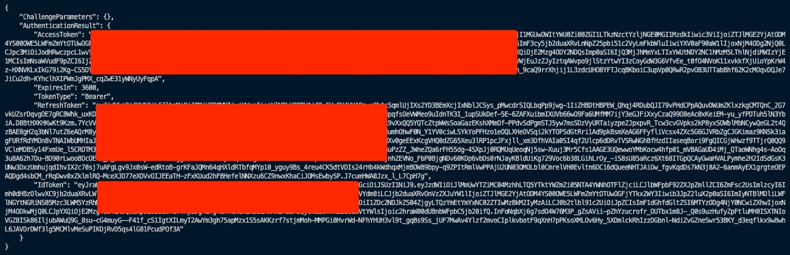

# How to protect data with format-preserving encryption using AWS Lambda

Sanghyoun Kim, Senior Cloud Architect, AWS Professional Services

Pseudonymization is a technique that replaces sensitive data with
cryptographically generated tokens, and format-preserving encryption,
also known and called as FPE hereafter, is extremely important and
useful for customers who wish to keep the ciphertext after encryption as
the same length as the plaintext.

In this article, we'll show how to write Lambda functions written in
Golang to protect sensitive data with format-preserving encryption as a
method of pseudonymization. All the resources required here will be
packaged and deployed using CDK, and you can be download the code used
in this walkthrough from the project's GitHub repo.

## Overview

Organizational policies, industry or government regulations, might
require the use of encryption at rest to protect sensitive data. Amazon
Web Services (AWS) provides a variety of flexible options that customers
can choose from to meet this requirement.

If you require a various layer of security for the data you store in the
cloud, there are several options for encrypting data at rest - ranging
from completely automated AWS encryption solutions to manual,
client-side options.

[AWS KMS Envelope
Encryption](https://docs.aws.amazon.com/kms/latest/developerguide/concepts.html#enveloping)
with [AWS Encryption
SDK](https://docs.aws.amazon.com/encryption-sdk/latest/developer-guide/java-example-code.html)
may be adopted to protect sensitive data such as PII (Personally
Identifiable Information), social security number, or credit card
number.

Envelope encryption offers several benefits in protecting data keys,
encrypting the same data under multiples keys, and combining the
strength of multiple algorithms, but due to the inevitable nature of
block mode encryption, you have to consider various changes needed to
the storage or business side such as the type or length of database
column, log file format, big data analytics.

In the meantime, there may be some more business requirements in which
customers have the ability to encrypt data using format-preserving
encryption (FPE) that allows ciphertext to be inserted into the
databases, files, or data lakes without breaking the schema.

In general, FPE is an encryption technology designed to produce
ciphertext that resembles the plaintext from which it originates. For
example, payment card numbers still look like payment card numbers,
often with some of the plaintext digits remaining intact, which can be
useful for continuing to use the ciphertext version for routing and card
verification.

FPE also allows a highly granular approach to encryption, which
facilitates field-level protection. It also preserves business
func­tionality, meaning that normal data processing activities are
maintained even though the data is encrypted. FPE fulfills both
encryption and pseudonymization functions, which makes it a particularly
useful technol­ogy in the context of providing some assistance with GDPR
compliance.

The GDPR specifically calls out the use of pseudonymization and
encryption mechanisms as an acceptable means for protecting data.
Pseudonymization is often used as a general term that can apply to
various techniques for data de-identification when the pseudonym or
surrogate data can be used in business processes.

Another advantage of FPE is that the ciphertext is the same size as the
plaintext from which it originates. This can be very useful in terms of
ciphertext storage, as it often allows the ciphertext to be stored in a
field, such as a field in a database record, that was originally
designed to contain the plaintext.

In this blog, we will show how to implement an AWS Lambda function that
can be invoked to protect the data using format-preserving encryption.
The data encryption key will be generated by AWS KMS and stored in AWS
Secrets Manager. Amazon API Gateway will pass the encryption and
decryption requests from client to the backend Lambda that wraps the
[Golang implementation](https://github.com/capitalone/fpe) of [NIST
Recommendation SP
800-38G](http://nvlpubs.nist.gov/nistpubs/SpecialPublications/NIST.SP.800-38G.pdf)
algorithm provided by CapitalOne.

All the resources needed will be managed and deployed through AWS Cloud
Development Kit except the FPE data encryption key (DEK). FPE DEK will
be derived from KMS and stored in Secrets Manager at the first call of
the request, and remain in memory of Lambda function instance to reduce
subsequent invocation overhead for DEP decryption. But this can be
customized and adjusted to resort to KMS every time for request for
higher level of security requirement.

In summary, this solution offers following benefits:

1.  Compliance - In GDPR Article 4
    (http://www.privacy-regulation.eu/en/article-4-definitions-GDPR.htm),
    pseudonymization is described like this; \"5) \'pseudonymisation\'
    means the processing of personal data in such a manner that the
    personal data can no longer be attributed to a specific data subject
    without the use of additional information, provided that such
    additional information is kept separately and is subject to
    technical and organisational measures to ensure that the personal
    data are not attributed to an identified or identifiable natural
    person\". **Format-preserving encryption** (**FPE**), refers to
    encrypting in such a way that the output (the ciphertext) is in the
    same format as the input (the plaintext; Wikipedia). Customer may
    want to adopt format-preserving encryption as a candidate method of
    pseudonymization if they have measures in place conforming to the
    above GDPR article, for example, by storing pseudonymized data in
    the private database, keeping the encryption key used in separate
    and safe place, and enforcing appropriate access control to all of
    these.

2.  Operational Advantage - In addition, one of the benefits of FPE is
    the potential to modify only the endpoints of the communication
    while leaving all intermediate systems and storage layouts
    unaltered. Coupled with the standard AES encryption scheme for data
    protection, this potential can reduce the compliance assessment
    scope by removing the related systems from them, with PCI-DSS as a
    good example. Another benefit of FPE is that customer could use it
    to generate test data from production data in which would give them
    very good and quality data to use in test. Hence, customer can save
    the time and reduce remediation costs to meet compliance
    requirements.

3.  (This benefits is only informative from the point of internal sales
    play, so should be removed when ready to publish to public)\
    Competitiveness - Google Cloud already provides users access to a
    de-identification technique called pseudonymization, which supports
    three different methods of pseudonymization:\
    - **Deterministic encryption using AES-SIV\
    - Format-Preserving Encryption\
    - Cryptographic hashing\
    **It is described under \"Cloud Data Loss Prevention\" and details
    about FPE can be found
    here: https://cloud.google.com/dlp/docs/samples/dlp-deidentify-fpe.
    The objective of this artifact is not to suggest official response
    or request similar feature at production level, but just to
    introduce the concept of FPE to the customers and provide how to
    implement over AWS cloud in case they feel it necessary for their
    business or technical purpose.

## Business and technical assumptions

Here is one example where this solution is helpful to solve business or
technical cases.

1.  The customer needs to protect their PII data by encryption, but they
    also want to keep the format of ciphertext due to the technical
    requirements to do so, for example:\
    - They cannot alter the schema of database columns that store the
    original PII data.\
    - SAP is being operated as a core system for various business area;
    SAP does have strict constraint that any standard module or database
    table cannot be modified.\
    - They also have interfaces calling to or being called from 3rd
    party solution venders, and those are not capable nor willing to
    change the protocol of payload over these interfaces.

2.  The customer managed KMS key exists in AWS Account.

3.  The customer is willing to keep sensitive credentials or keys in
    Amazon Secrets Manager.

4.  The customer has developer resource to build Lambda function and API
    Gateway.

## Walkthrough

This solution uses [AWS Key Management
Service](https://aws.amazon.com/kms/), [AWS Secrets
Manager](https://aws.amazon.com/secrets-manager), [AWS
Lambda](https://aws.amazon.com/lambda/), [Amazon API
Gateway](https://aws.amazon.com/api-gateway/), [Amazon
Cognito](https://aws.amazon.com/cognito) and [AWS Cloud Development
Kit](https://aws.amazon.com/cdk/).

{width="6.5in"
height="4.620833333333334in"}

1.  The resources are deployed by AWS Cloud Development Kit (CDK).

2.  Client authenticates to Amazon Cognito.

3.  The client makes request to protect their data with payload
    parameter for format-preserving encryption or decryption against
    Amazon API Gateway along with the JWT token retrieved from the
    Cognito in the previous step. The payload parameter contains the
    information about plaintext or ciphertext for encryption or
    decryption respectively in JSON format, along with \"Radix\". The
    request path determines which operation should take place, for
    example \"https://\<API Gateway Execution URL>/encrypt\" will
    trigger encryption to be executed, and \"https://\<API Gateway
    Execution URL>/decrypt\" for decryption likewise. \"Radix\"
    specifies the size of the alphabet. For example, specifying 2 gives
    an alphabet consisting of the numbers 0 and 1, specifying 62 gives
    alphabet with all numeric, upper-case alpha, lower-case alpha
    (1234567890abcdefghijklmnopqrstuvwxyzABCDEFGHIJKLMNOPQRSTUVWXYZ, 62
    in total), while specifying 95 gives an alphabet with all numeric,
    upper-case alpha, lower-case alpha, and symbol characters. In this
    project, it is restricted to be between 2 and 62 due to the
    implementation of [embedded FPE
    library](https://github.com/capitalone/fpe).

4.  Amazon API Gateway validates the token against the Cognito.

5.  If the authentication token is valid, Amazon API Gateway passes over
    the requests to AWS Lambda function.

6.  AWS Lambda function tries to load FPE data encryption key from AWS
    Secret Manager that is stored in encrypted form with AWS KMS CMK
    master key.

    a.  (Alt-5-1) If the FPE date encryption key is not stored in the
        specified secret value of Secrets Manager, then the Lambda
        function calls \"GenerateDataKey\" API to AWS KMS.

    b.  (Alt-5-2) Then, the CiphertextBlob part of the generated key is
        stored into a secret value after creating it (a secret value) in
        Secrets Manager.

7.  The Lambda function decrypts the data encryption key by calling
    \"Decrypt\" function of AWS KMS, and loads its plaintext form into
    the global state memory.

    a.  Note) Loading the plain bytes of data encryption key to global
        state memory is not conformant to some highly regulated
        environment. If that is the case, the source code can be
        customized to remove this part. However if you tune this project
        to load data encryption key at every call, the data encryption
        key should be decrypted by KMS first and you might exceed the
        AWS KMS [requests-per-second
        limit](https://docs.aws.amazon.com/kms/latest/developerguide/limits.html#requests-per-second)
        under many request situation, causing processing delays. You can
        use tools such as JMeter to test the required throughput based
        on the expected traffic for this method. If you need to exceed a
        quota, you can request a quota increase in Service Quotas. Use
        the Service Quotas console or
        the RequestServiceQuotaIncrease operation. For details,
        see Requesting a quota increase in the Service Quotas User
        Guide. If Service Quotas for AWS KMS are not available in the
        AWS Region, create a case in the AWS Support Center.

8.  AWS Lambda function returns the result back to API Gateway.

9.  Finally, API Gateway delivers response to the client.

### Prerequisites

For this walkthrough, the solution is deployed using AWS CDK, and you
should have the following prerequisites:

-   An AWS account

-   You must have the AWS Command Line Interface (AWS CLI) configured
    with permission to create required resources for AWS KMS Key, AWS
    Lambda function, Amazon API Gateway, and Amazon Cognito.

-   You must have AWS CDK installed.

-   You must also have [Golang](https://golang.org/) or Docker installed
    to build and bundle the Lambda function locally or from inside a
    Docker container.

### Deploying the solution

**Step 1**: Clone the [GitHub
repository](https://github.com/shkim4u/protecting-data-with-fpe-pseudonymization)
and synthesize the application with the AWS CDK. Run the following
commands in a terminal:

git clone
https://github.com/shkim4u/protecting-data-with-fpe-pseudonymization

cd protecting-data-with-fpe-pseudonymization

cdk synth

**Note**: When running the synth command for the first time and if
Golang is not installed on local computer, the CDK application will pull
the Docker image for bundling image for Go Lambda function. This step
might take few minutes to complete depending on your internet connection
bandwidth.

{width="6.5in"
height="5.659027777777778in"}

**Step 2**: Deploy the application:

cdk deploy \--all \--outputs-file [./cdk-outputs.json]{.underline}

Approve the AWS Identity and Access Management (IAM)-related changes and
continue to deploy the stack. Once deployment is completed, the stack
outputs the API Gateway HTTP API endpoint, KMS Key ARN, User Pool Client
ID, and User Pool IC.

{width="6.5in"
height="1.4694444444444446in"}

Step 3: Sign-up (register) a user in the Cognito using AWS CLI command
looking like below.

aws cognito-idp sign-up \\

\--client-id \<YOUR_USER_POOL_CLIENT_ID> \\

\--username \"test\@test.com\" \\

\--password \"password123\"

{width="3.9492749343832023in"
height="1.4663593613298338in"}

Note) Once registration is completed as displayed below, the
confirmation email will be sent to your inbox.

Step 4: Confirm the user so that they can login.

aws cognito-idp admin-confirm-sign-up \\

\--user-pool-id YOUR_USER_POOL_ID \\

\--username \"test\@test.com\"

{width="6.5in"
height="1.8819444444444444in"}

Step 5: Login to Cognito and get the ID token.

aws cognito-idp initiate-auth \\

\--auth-flow USER_PASSWORD_AUTH \\

\--auth-parameters \\

USERNAME=\"test\@test.com\",PASSWORD=\"password123\" \\

\--client-id YOUR_USER_POOL_CLIENT_ID

The response will be very long due to its lengthy tokens. We only care
about the **IdToken**, so copy and paste it into a notepad, because we
will need it when invoking the API.

{width="6.5in"
height="2.1006944444444446in"}

**Step 6**: Validate the deployed application by invoking the HttpApi
URL from the output in Step 2:

(1) Encryption

curl \--location \--request POST
\'https://\<hash>.execute-api.ap-\<region>.amazonaws.com/encrypt\' \\

\--header \'Content-Type: application/json\' \\

\--header \'Authorization: YOUR_ID_TOKEN\' \\

\--data-raw \'{

\"input\":
\"1234567890ABCDEFGHIJKLMNOPQRSTUVWXYZabcdefghijklmnopqrstuvwxyz

\",

\"radix\": 62

}\'

{\"operation\":\"Encrypt\",\"plaintext\":\"1234567890ABCDEFGHIJKLMNOPQRSTUVWXYZabcdefghijklmnopqrstuvwxyz\",\"ciphertext\":\"gGlQUbOxsnKU0or7Z84rYWivYTl0QY19kWlAneDyZmpu7NofuyHbQvd47B1lBi\",\"radix\":62}

{width="6.5in" height="2.1in"}

(2) Decryption

curl \--location \--request POST
\'https://\<hash>.execute-api.ap-\<region>.amazonaws.com/encrypt\' \\

\--header \'Content-Type: application/json\' \\

\--header \'Authorization: YOUR_ID_TOKEN\' \\

\--data-raw \'{

\"input\":
\"gGlQUbOxsnKU0or7Z84rYWivYTl0QY19kWlAneDyZmpu7NofuyHbQvd47B1lBi\",

\"radix\": 62

}\'

{\"operation\":\"Decrypt\",\"plaintext\":\"1234567890ABCDEFGHIJKLMNOPQRSTUVWXYZabcdefghijklmnopqrstuvwxyz\",\"ciphertext\":\"gGlQUbOxsnKU0or7Z84rYWivYTl0QY19kWlAneDyZmpu7NofuyHbQvd47B1lBi\",\"radix\":62}

{width="6.5in" height="2.11875in"}

We completed to deploy a Lambda function along with other resources for
FPE processing, built and packaged natively via AWS CDK, which should
look similar like below when you can also deploy them at your
environment.

{width="6.5in"
height="5.552083333333333in"}

## 

## Understanding the CDK and Lambda code

Now that we have seen how to build and deploy the resources, let's dive
into the code of the CDK stack, which takes care of packaging and
building the one Lambda function and other resources for it out of the
box.

### Lambda function for format-preserving encryption

In this example, we have created a Golang 1.x Lambda function to handle
format-preserving cryptographic requests.

The \"main.go\" file in \"lambda/fpe\" directory contains the logic to
process encryption or decryption request incoming through API Gateway.

It then invokes the specified operation by determining the request path,
for example calling to encryption function implemented in
\"handlers.go\" file for \"/encrypt\" and decryption function for
\"/decrypt\" respectively as shown below.

path := req.RequestContext.HTTP.Path

*switch* path {

*case* \"/encrypt\":

*return* handlers.Encrypt(params.Input, params.Radix, ctx, req)

*case* \"/decrypt\":

*return* handlers.Decrypt(params.Input, params.Radix, ctx, req)

default:

*return* handlers.UnhandledOperation()

}

There are three methods used in the \"handlers.go\" file:

-   *init() *function loads the FPE data encryption key (DEK) from
    Secrets Manager. If DEK is not found there at the very first call
    for encryption or decryption, it generates data encryption key by
    requesting KMS and then stores its encrypted version into the
    Secrets Manager. The loaded or generated DEK from Secrets Manager or
    KMS is now decrypted by KMS and assigned to plain data encryption
    key which resides in global state. This function is automatically
    called by Golang runtime when the \"handlers.go\" module is
    initialized.

func init() {

fmt.Println(\"{Handlers} Initializing to acquire FPE data encryption
key.\")

*var* dekEnvelopeBlob \[\]byte

exist, secretValue :=
secretsManagerClient.CheckIfSecretValueExist(os.Getenv(\"FPE_DATA_KEY_SECRET_NAME\"))

*if* exist {

// FPE data encryption key sucessfully retrieved from Secrets Manager.

// Parse it as byte array.

fmt.Println(\"Encrypted FPE Data Encryption Key: \", \*secretValue)

// \[2021-11-20\] Decrypt FPE data encryption key.

dekEnvelopeBlob, \_ = hex.DecodeString(\*secretValue)

} *else* {

// Secret value for FPE data encryption key does not exist, create a new
one

dekEnvelopeBlob =
kmsClient.GenerateDEK(os.Getenv(\"FPE_MASTER_KEY_ARN\"))

secretsManagerClient.CreateSecretWithValue(

os.Getenv(\"FPE_DATA_KEY_SECRET_NAME\"),

hex.EncodeToString(dekEnvelopeBlob),

\"FPE data enryption key protected by KMS CMK.\",

)

}

dekBlob = kmsClient.DecryptDEK(dekEnvelopeBlob)

}

-   Encrypt() function is called by \"main.go\" file when the request
    path is \"/encrypt\". It wraps the FPE implementation provided by
    CapitalOne with the Go module name \"github.com/capitalone/fpe/ff1\"
    to create a cipher instance and encrypt the plaintext from the
    request parameter.

func Encrypt(

input string,

radix int,

ctx context.Context, // *Reserved.*

req events.APIGatewayV2HTTPRequest, // *Reserved.*

) (

events.APIGatewayV2HTTPResponse,

error,

) {

*var* resp FpeResponse

// Key and tweak should be byte arrays. Put your key and tweak here.

key := dekBlob

tweak, err := hex.DecodeString(\"D8E7920AFA330A73\")

*if* err != nil {

*return* HandleError(http.StatusInternalServerError,
errors.New(err.Error()))

}

// Create a new FF1 cipher \"object\"

FF1, err := ff1.NewCipher(radix, 8, key, tweak)

*if* err != nil {

*return* HandleError(http.StatusInternalServerError,
errors.New(err.Error()))

}

plaintext := input

// Call the encryption function on a plaintext

ciphertext, err := FF1.Encrypt(plaintext)

*if* err != nil {

*return* HandleError(http.StatusInternalServerError,
errors.New(err.Error()))

}

// WARNING) For debugging only

fmt.Println(\"Plaintext:\", plaintext)

fmt.Println(\"Ciphertext:\", ciphertext)

// Set response.

resp.Operation = \"Encrypt\"

resp.Plaintext = plaintext

resp.Ciphertext = ciphertext

resp.Radix = radix

*return* apiResponse(

http.StatusOK,

&resp,

)

}

-   Decrypt() function is also triggered by \"main.go\" file when the
    request path is \"/decrypt\". It handles the decryption operation by
    taking the same steps as the \"Encrypt()\" function, except that it
    takes ciphertext as it parameter and returns its plaintext by
    decrypting it.

func Decrypt(

input string,

radix int,

ctx context.Context, // *Reserved.*

req events.APIGatewayV2HTTPRequest, // *Reserved.*

) (

events.APIGatewayV2HTTPResponse,

error,

) {

*var* resp FpeResponse

// Key and tweak should be byte arrays. Put your key and tweak here.

key := dekBlob

tweak, err := hex.DecodeString(\"D8E7920AFA330A73\")

*if* err != nil {

*return* HandleError(http.StatusInternalServerError,
errors.New(err.Error()))

}

FF1, err := ff1.NewCipher(radix, 8, key, tweak)

*if* err != nil {

*return* HandleError(http.StatusInternalServerError,
errors.New(err.Error()))

}

ciphertext := input

// Call the encryption function on an example SSN

plaintext, err := FF1.Decrypt(ciphertext)

*if* err != nil {

*return* HandleError(http.StatusInternalServerError,
errors.New(err.Error()))

}

// WARNING) For debugging only

fmt.Println(\"Ciphertext:\", ciphertext)

fmt.Println(\"Plaintext:\", plaintext)

// Set response.

resp.Operation = \"Decrypt\"

resp.Plaintext = plaintext

resp.Ciphertext = ciphertext

resp.Radix = radix

*return* apiResponse(

http.StatusOK,

&resp,

)

}

This Lambda function is packaged and deployed by CDK as explained below.

### CDK application

-   Creating a Lambda function

In this artifact, we have created a Golang 1.x Lambda function. The rest
of the configuration is fairly typical, except for how the code for the
function is configured. It uses the Code.*fromAsset* API to pass the
path to the directory where the code for the Lambda function exists
along with bundling options:

To create a Golang-based Lambda function, we must first create a Lambda
function [deployment
package](https://docs.aws.amazon.com/lambda/latest/dg/golang-package.html).
For Go, this consists of a .zip file containing a Go executable.

Because we don't commit the Go executable to our source repository, our
CDK synth process must perform the necessary steps to create it.

In the context of the AWS CDK, when we create a Lambda function, we also
have to tell the AWS CDK where to find the deployment package. See the
following example code:

new lambda.Function(this, \'MyGoFunction\', {

runtime: lambda.Runtime.GO_1\_X,

handler: \'main\',

code: lambda.Code.fromAsset(path.join(\_\_dirname,
\'folder-containing-go-executable\')),

});

In the preceding code, the lambda.Code.fromAsset() method tells the AWS
CDK where to find the Golang executable. When we run cdk synth, it
stages this Go executable in the cloud assembly, which it zips and
publishes to Amazon S3 as part of the PublishAssets stage.

If we're running the AWS CDK to deploy resources, this Golang executable
doesn't exist yet, so how do we create it? One method is [CDK
bundling](https://docs.aws.amazon.com/cdk/api/latest/docs/@aws-cdk_core.BundlingOptions.html).
The lambda.Code.fromAsset() method takes a second optional
argument, [AssetOptions](https://docs.aws.amazon.com/cdk/api/latest/docs/@aws-cdk_core.AssetOptions.html),
which contains the bundling parameter. With this bundling parameter, we
can tell the AWS CDK to perform steps prior to staging the files in the
cloud assembly.

Breaking down
the [BundlingOptions](https://docs.aws.amazon.com/cdk/api/latest/docs/@aws-cdk_core.BundlingOptions.html) parameter
further, we can perform the build locally or inside a Docker container.

Note) This artifact is developed and tested on \"local\" mode at the
time of writing.

For more details about bundling Lambda function in Golang, you can refer
to \"[Building, bundling, and deploying applications with the AWS
CDK](https://aws.amazon.com/blogs/devops/building-apps-with-aws-cdk/)\"
in [AWS DevOps Blog](https://aws.amazon.com/blogs/devops/).

The whole code snippet of CDK to create Lambda function looks like
below:

// Create Lambda function.

const fpeLambdaFunction = new lambda.Function(

this,

\'FpeLambdaFunction\',

{

code: lambda.Code.fromAsset(

asset,

{

bundling: {

// Try to bundle on the local machine.

local: {

tryBundle(outputDir: string) {

console.log(\`Output Directory: \${outputDir}\`);

// Ensure that all the required dependencies are installed locally.

try {

exec(

\'go version\',

{

stdio: \[

\'ignore\', // Ignore stdio.

process.stderr, // Redirect stdout to stderr.

\'inherit\' // Inherit stderr.

\],

}

);

} catch {

// If Go is not installed, then just return false to tell the CDK to
attempt bundling with Docker.

return false;

}

exec(

\[

\'go test -v\', // Test first.

\`go build -mod=vendor -o \${path.join(outputDir, \'bootstrap\')}\`

\].join(\' && \'),

{

env: { \...process.env, \...environment},

stdio: \[

\'ignore\', // Ignore stdio.

process.stderr, // Redirect stdout to stderr.

\'inherit\' // inherit stderr.

\],

cwd: asset, // Workding directory to run the build command from.

},

);

return true;

},

},

image: lambda.Runtime.GO_1\_X.bundlingImage,

command: \[

\'bash\',

\'-c\',

\[

\'go test -v\',

\'go build -mod=vendor -o /asset-output/bootstrap\',

\].join(\' && \')

\],

environment: environment

},

}

),

// If we name our handler \'bootstrap\' we can also use the \'provided\'
runtime.

handler: \'bootstrap\',

// handler: \'main\',

runtime: lambda.Runtime.GO_1\_X,

environment: {

\'FPE_MASTER_KEY_ARN\': fpeMasterKey.keyArn,

\'FPE_DATA_KEY_SECRET_NAME\': \'/secret/fpe/datakey\'

}

}

);

-   Creating a Cognito User Pool and HTTP Authorizer

To protect our API Gateway which will be explained soon below, we need
to create a Cognito user pool and authorizer that validates the JWT
token passed to the FPE API.

The authorizer will be attached to each routes that the API Gateway will
expose.

// User pool.

const userPool = new cognito.UserPool(

this,

\`fpe-userpool\`, {

userPoolName: \`fpe-userpool\`,

removalPolicy: cdk.RemovalPolicy.DESTROY,

selfSignUpEnabled: true,

signInAliases: {email: true},

autoVerify: {email: true},

passwordPolicy: {

minLength: 8,

requireLowercase: true,

requireDigits: true,

requireUppercase: true,

requireSymbols: true,

},

accountRecovery: cognito.AccountRecovery.EMAIL_ONLY

}

);

// User pool client.

const userPoolClient = new cognito.UserPoolClient(

this,

\`fpe-userpool-client\`,

{

userPool,

authFlows: {

adminUserPassword: true,

userPassword: true,

custom: true,

userSrp: true,

},

supportedIdentityProviders: \[

cognito.UserPoolClientIdentityProvider.COGNITO,

\],

}

);

// Create the authorizer.

const authorizer = new apiGatewayAuthorizers.HttpUserPoolAuthorizer(

{

userPool,

userPoolClients: \[userPoolClient\],

identitySource: \[\'\$request.header.Authorization\'\],

}

);

-   Creating an API Gateway

CDK will create an Amazon API Gateway to expose the functionality of
Lambda function described above. In this case, [HTTP
API](https://docs.aws.amazon.com/apigateway/latest/developerguide/http-api.html)
is selected to pass FPE encryption or decryption requests to the Lambda
function.

const api = new apigatewayv2.HttpApi(

this,

\'FpeApi\',

{

*description*: \'Format Preserving Pseudonumization API\',

createDefaultStage: true,

corsPreflight: {

allowHeaders: \[

\'Content-Type\',

\'X-Amz-Date\',

\'Authorization\',

\'X-Api-Key\',

\],

// allowCredentials: true,

allowMethods: \[CorsHttpMethod.POST\],

allowOrigins: \[\'\*\'\]

}

}

);

api.addRoutes(

{

path: \'/encrypt\',

integration: new *LambdaProxyIntegration*(

{

handler: fpeLambdaFunction

}

),

methods: \[apigatewayv2*.HttpMethod.*POST\],

authorizer: authorizer // *Authorizer.*

}

);

api.addRoutes(

{

path: \'/decrypt\',

integration: new *LambdaProxyIntegration*(

{

handler: fpeLambdaFunction

}

),

methods: \[apigatewayv2*.HttpMethod.*POST\],

authorizer: authorizer // *Authorizer.*

}

);

### More considerations on key rotation and re-key

Format-preserving encryption is very useful when it comes to keep
balance between rigorous cryptographic regulations for data protection
and practical implementation needed to maintain business or technical
workflows.

However, the fact that it keeps the format of original data also means
that it\'s not easy to embed some sort of opaque information in the
ciphertext that specifies which key attributes should be used for
processing encryption and decryption, because doing so will inevitably
break the \"being format-preserved\" unless some additional
considerations is taken.

Some researchers are investigating to shed some clues to this
requirement and one example of these can be found here -- [Progressive
Key Rotation for Format-Preserving
Encryption](https://patents.google.com/patent/US10157289B2/en).

### Cleaning up

To avoid incurring future charges, delete the resources using the CDK
destroy command.

cdk destroy \--all

{width="6.5in"
height="0.8847222222222222in"}

## Conclusion

Pseudonymization is a technique that replaces sensitive data with
cryptographically generated tokens. This artifact shows how to protect
data by pseudonymizing it with format-preserving encryption (FPE)
technology using a Lambda function. The data encryption key for FPE is
generated by AWS Key Management Service and stored in AWS Secrets
Manager for higher security.

Lambda function for format-preserving encryption then exposed through
Amazon API Gateway, which is protected by Amazon Cognito, which then can
be integrated with applications to protect sensitive information without
disrupting technical flows or shapes of data store because it keeps the
ciphertext after encryption as the same length and format as the
plaintext, which can bring less developmental and operational overhead.

### Author bio

  ----------------------------------------------------------------------------------------------------------------------
  {width="1.2608694225721784in"   Sanghyoun is Cloud Architect at Amazon Web Services
  height="1.6952865266841646in"}                                  helping customers to ignite and accelerate their
                                                                  journey to cloud. He enjoys swimming in his spare
                                                                  time, and he is quite enthusiastic at enlarging his
                                                                  technical area to AIML, microservice architecture,
                                                                  DevOps, security, and many others.
  --------------------------------------------------------------- ------------------------------------------------------

  ----------------------------------------------------------------------------------------------------------------------

**Suggested tags:** [Security](https://aws.amazon.com/security),
[Cryptography](https://docs.aws.amazon.com/crypto/latest/userguide/awscryp-service-toplevel.html),
[Format-Preserving
Encryption](https://nvlpubs.nist.gov/nistpubs/specialpublications/nist.sp.800-38g.pdf),
[AWS Key Management Service](https://aws.amazon.com/kms/), [AWS Secrets
Manager](https://aws.amazon.com/secrets-manager), [AWS
Lambda](https://aws.amazon.com/lambda/), [Amazon API
Gateway](https://aws.amazon.com/api-gateway/), [Amazon
Cognito](https://aws.amazon.com/cognito), [AWS Cloud Development
Kit](https://aws.amazon.com/cdk/).
